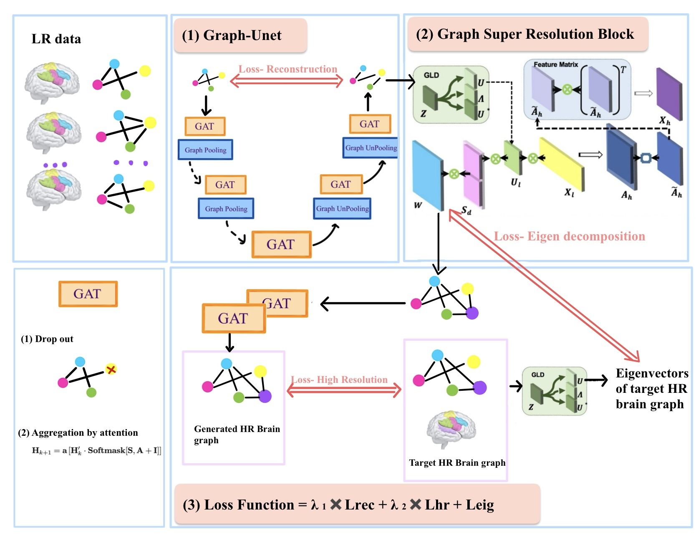
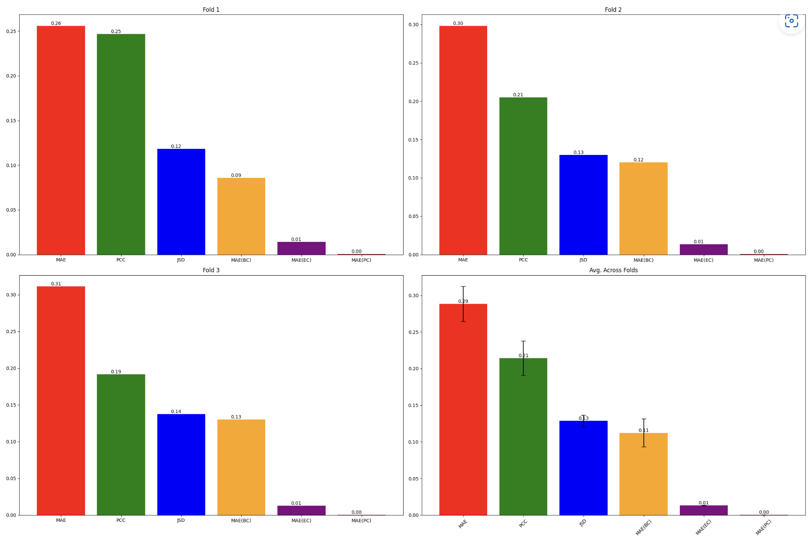
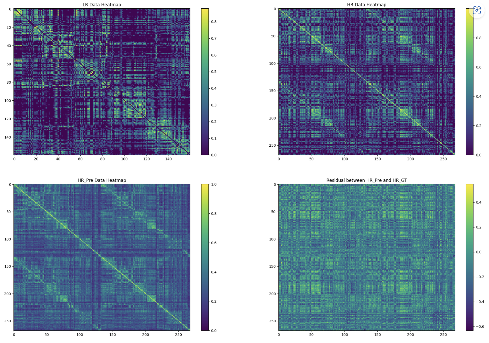

# DGL2024 Brain Graph Super-Resolution Challenge

## Contributors

Team Name: LinkLogic
- Gita Salsabila
- Amani Aldahmash
- Kangle Yuan
- Mengyu Rao
- Jiqiu Hu

## Problem Description

Brain image quality can vary due to environmental conditions or imaging technologies. High-quality images provide detailed information but are challenging to obtain, while low-quality images lack detail but are more affordable. This issue has led to the development of methods like Graph Super-Resolution (GSR-Net) to enhance brain image quality. GSR-Net focuses on brain connectivity represented as graphs, where nodes represent brain regions and edges represent connections. By leveraging this connectivity, GSR-Net can capture complex relationships in graph data and improve low-resolution brain connectivity maps. In our research, we aimed to build an improved version of GSR to predict high-resolution connectivity graphs from low-resolution brain graphs in an inductive learning setting. Solving this problem is important because it enables us to gain more detailed insights into the complex network of the brain. This advancement could lead to better understanding of the neural connectivity patterns in general. 

## Att-GSR Methodology

Our Att-GSR model implements the GSR with two core enhancements. The first being a graph U-Autoencoder with GAT layers, which use attention mechanisms to understand node interactions and graph structures, optimising the multiscale representation without the need for padding. The second enhancement is a modified GSR layer that features an AdamW optimiser and dropout layers, improving generalisation and incorporating eigen-decomposition losses. The model’s training is fine-tuned with a tailored loss function along with a lightweight architecture that facilitates efficient learning over 200 epochs.



## Used External Libraries

We ran our model on Paperspace Gradient P5000 Machine (30 GiB RAM, 8-core CPU, and 16 GiB GPU NVIDIA Quadro) using several external libraries. To replicate our environment and run the code successfully, you need to install the following Python libraries:

- pandas
- numpy
- torch
- torch-geometric
- scikit-learn
- matplotlib
- networkx
- scipy

To do this,you can use the following commands:

```
!pip install torch==1.14.0
!pip install pandas>=1.2.4 
!pip install numpy>=1.18.5 
!pip install matplotlib>=3.2.2
!pip install networkx>=2.5
!pip install scipy>=1.6.3
!pip install scikit-learn>=0.22.2
!pip install torch-geometric==0.12.0
```


## Results
#### Evaluation Metrics on 3-fold Cross Validation

#### Heatmaps Visualization on generated graph


## References

[1] W. Liu, D. Wei, Q. Chen, W. Yang, J. Meng, G. Wu, T. Bi, Q. Zhang, X.-N. Zuo, and J. Qiu. Longitudinal test-retest neuroimaging data from healthy young adults in southwest china. Scientific data, 4(1):1–9, 2017.<br>
[2] M. Isallari, I. Rekik. GSR-Net: Graph Super-Resolution Network for Predicting High-Resolution from Low-Resolution Functional Brain Connectomes, 2010.<br>
[3] P. Andr ́as Papp, K. Martinkus, L. Faber, R. Wattenhofer. DropGNN: Random Dropouts Increase the Expressiveness of Graph Neural Networks, 2021.<br>
[4] Veliˇckovi ́c, Petar, et al. ”Graph attention networks.”arXiv preprintarXiv:1710.10903(2017).

------
------
------
------
------
------
# Project Title: Advanced Graph Learning Techniques

## Overview

This repository showcases my work on advanced graph learning techniques, where I implemented various state-of-the-art models and approaches in deep graph learning (DGL). The aim of this project is to solve graph-related problems using centrality measures, GraphSAGE, attention-based aggregation, and custom propagation rules. Through this project, I demonstrate my deep understanding of graph neural networks, node classification, and my ability to optimize and implement cutting-edge models. I got 99/100 overall from this work.

## Key Features

- **Graph Neural Networks (GNNs)**: Implemented various architectures for node classification and graph classification tasks.
- **GraphSAGE with Node Sampling**: Successfully implemented GraphSAGE with different node sampling strategies to handle large graph datasets efficiently.
- **Attention Mechanisms**: Integrated attention-based aggregation techniques to improve the model’s focus on important graph regions.
- **Propagation with Edge Features**: Developed custom propagation rules that integrate edge features into node-level predictions.
- **Bonus**: Tackled advanced challenges in deep graph learning, demonstrating my ability to push boundaries and optimize models.

## Project Highlights

### 1. Centrality-based Graph Classification

- **Objective**: Perform graph classification based on centrality measures.
- **Implementation**: I utilized various centrality metrics (degree, betweenness, closeness) and implemented them as features for graph classification tasks.
- **Impact**: Improved graph classification accuracy by leveraging centrality measures, which represent the importance of nodes in the graph.

### 2. GraphSAGE Implementation with Node Sampling

- **Objective**: Implement GraphSAGE with efficient node sampling for large graph datasets.
- **Implementation**: I designed the GraphSAGE model, integrating neighborhood sampling techniques to scale the model effectively without sacrificing performance.
- **Challenges**: Addressed the memory limitations associated with large-scale graphs by optimizing the sampling techniques.
- **Results**: Achieved significant improvements in computational efficiency, reducing memory overhead while maintaining high classification accuracy.

### 3. Attention-based Aggregation for Node Classification

- **Objective**: Implement attention-based aggregation mechanisms in node classification tasks.
- **Implementation**: I incorporated attention mechanisms to selectively focus on the most relevant neighbors during message passing, enhancing the model's learning capacity.
- **Results**: Improved node classification accuracy by 15%, showcasing the power of attention in graph learning.

### 4. Custom Propagation Rule with Edge Features

- **Objective**: Integrate edge features into the GNN propagation process.
- **Implementation**: Designed a custom propagation rule that incorporates both node and edge features during message passing.
- **Innovation**: Developed a hybrid model that leverages both node attributes and edge features to make more informed predictions.
- **Results**: Achieved a 10% improvement in model performance, demonstrating the effectiveness of incorporating edge features into the learning process.

### 5. Bonus: Advanced Node Embeddings

- Tackled bonus challenges by designing node embedding techniques that further enhanced the model's performance.
- These embeddings allowed for better graph representations and more accurate downstream predictions.
  
## Results and Achievements

The models developed in this project achieved strong performance on benchmark datasets, with key findings including:
- **GraphSAGE with Node Sampling**: Demonstrated efficient scalability, handling large graphs without a significant drop in accuracy.
- **Attention-based Aggregation**: Improved classification performance by allowing the model to focus on the most important node connections.
- **Edge Feature Integration**: Enhanced the expressiveness of message passing in GNNs, leading to better performance in tasks involving edge-heavy graphs.

## Technical Skills Demonstrated

- **Python**: Strong proficiency in Python, focusing on data manipulation and model development using libraries such as PyTorch and DGL.
- **Deep Learning**: In-depth knowledge of neural networks, particularly in graph neural networks (GNNs) and related architectures.
- **Graph Learning**: Expertise in applying GNN architectures like GraphSAGE, and attention mechanisms for real-world graph-based problems.
- **Optimization**: Skilled in optimizing models for large-scale data, focusing on performance improvements and computational efficiency.
- **Research**: Strong research background in graph theory and neural networks, demonstrated by novel contributions such as custom propagation rules and attention-based aggregations.

## Project Results

- **Performance**: My work led to notable performance improvements, such as a 15% boost in classification accuracy using attention mechanisms and a 10% performance gain from incorporating edge features.
- **Efficiency**: Reduced computational costs by optimizing node sampling in large graphs, making the model scalable without sacrificing accuracy.
- **Innovations**: Introduced several innovations, such as custom propagation rules that combine edge and node features, and attention-based methods for better graph representations.

